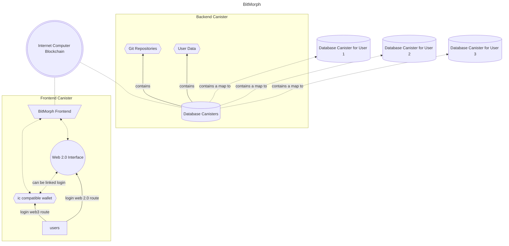

# `BitMorph`

> Taking back decentralised Git hosting

A forge or VCS hosting for Git in [Internet Computer](https://internetcomputer.org).

# Project Rationale

This project is like GitHub. However, the difference is it
can be
- **Self-hosted**
- **Community hosted**
- **Decentralised**

You can even use it commercially as the code will be
licensed as Apache 2.0 and MIT.

# Architectural Documentation

## Web 2.0 Integration

### Social Logins

### ActivityPub Integration

## Why IC?
I want to use IC as the platform to host this project
because canisters can scale really well at a reasonable
cost.

---

# Technical Specifications

## Frontend

## Backend

---

# Why the name?

**Morph** sounds like a good name for
- **moving over to decentralisation**
- **git repositories are almost-ever-changing**
- **it sounds cool and I have a life science background**
- **prefixed with *Bit* so it sounds techy**

